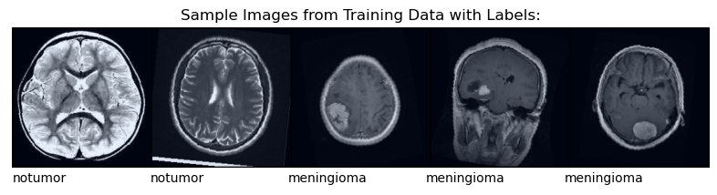
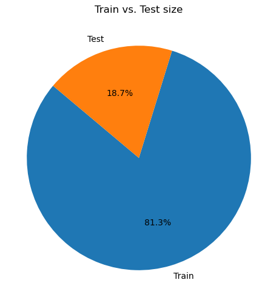
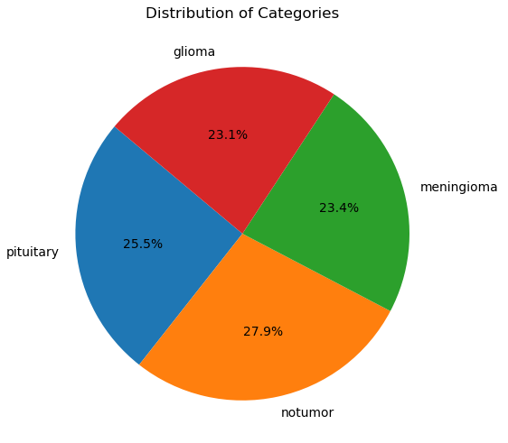
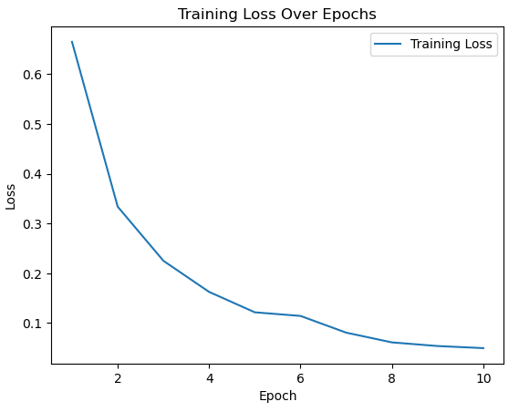

# Brain Tumor Classification with CNN using PyTorch

Welcome to my Brain Tumor Classification project! In this repository, I have implemented a Convolutional Neural Network (CNN) to classify brain tumor images using PyTorch. The goal was to build an accurate classifier that could assist in detecting brain tumors from MRI images.

## Dataset

The dataset used for this project consists of MRI brain tumor images. These images were kindly provided by Kaggle user [MASOUD NICKPARVAR](https://www.kaggle.com/datasets/masoudnickparvar/brain-tumor-mri-dataset). The dataset is organized into classes based on different types of brain tumors.

## Model Architecture

I designed a CNN architecture to handle the complex task of tumor classification. The CNN architecture is composed of multiple convolutional layers for feature extraction, followed by fully connected layers for classification. The complete model architecture can be found in the [code](brain-tumor-classifier-cnn-pytorch-acc-0-96.ipynb).

## Achieved Accuracy

After training the CNN model, I achieved an accuracy of 95.96% on the test dataset. This high accuracy demonstrates the effectiveness of the model in distinguishing between different classes of brain tumor images.

## Project Highlights

- Developed a CNN tumor classifier using PyTorch.
- Utilized data augmentation techniques for improved model generalization.
- Visualized the training loss over epochs to monitor model convergence.
- Achieved an impressive accuracy of 95.96% on the test dataset.

## Results

Here are some visualizations showcasing the project results:

- 
- 
- 
- 

## Credits

Special thanks to [MASOUD NICKPARVAR](https://www.kaggle.com/datasets/masoudnickparvar/brain-tumor-mri-dataset) for providing the MRI brain tumor images dataset.

